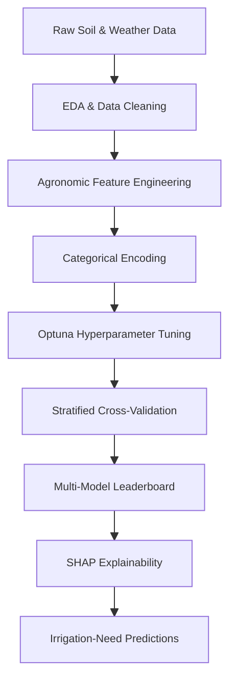
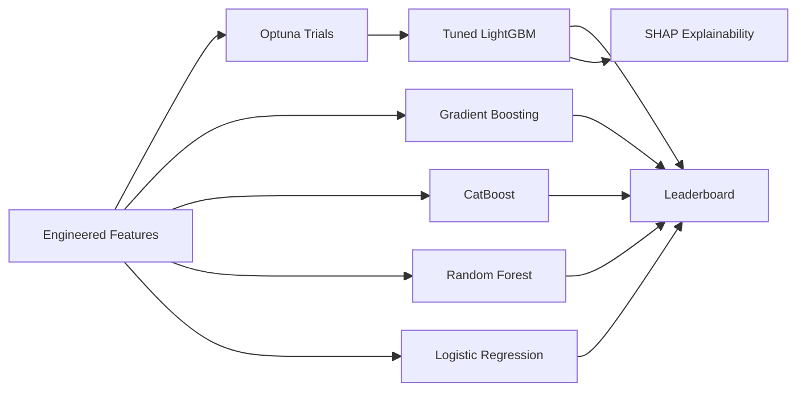
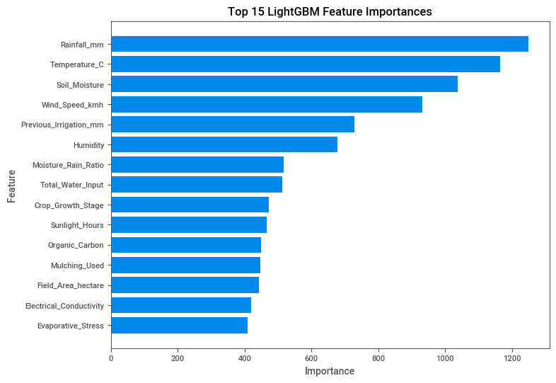
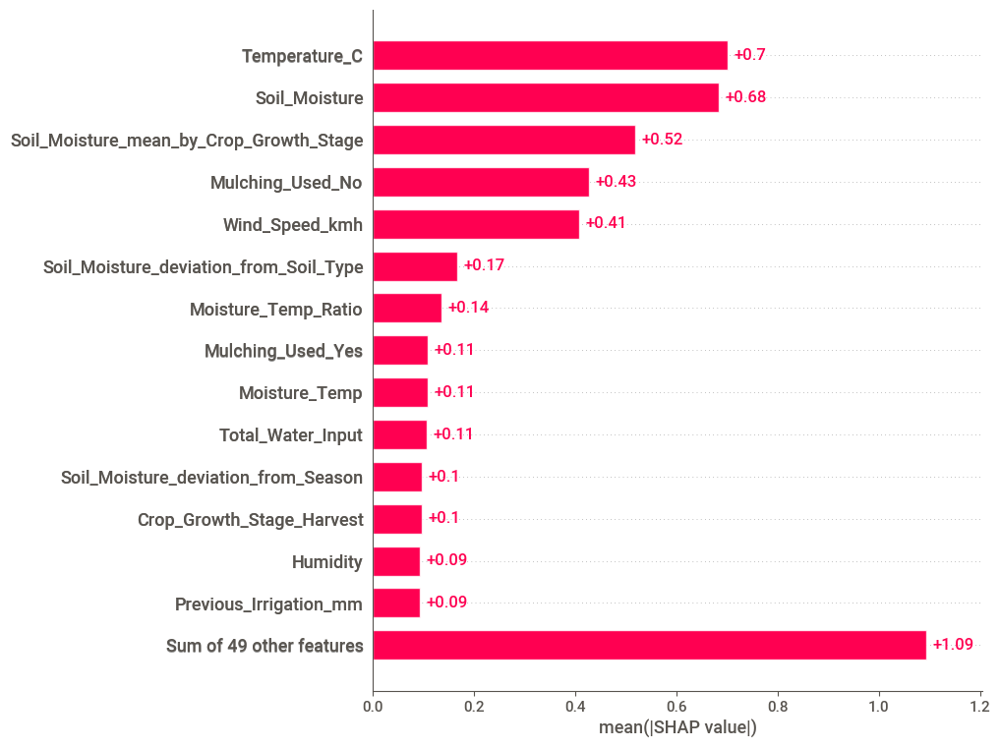
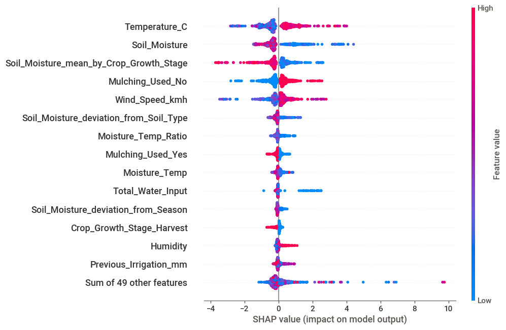
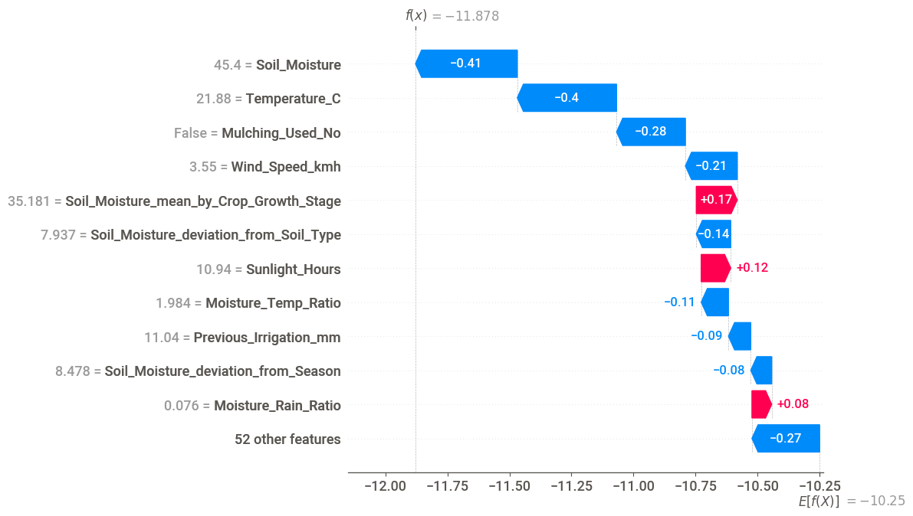

# Crop Irrigation Need Prediction


---

## Overview

This project predicts crop irrigation need from agricultural, weather, and soil-related features using a tuned LightGBM classifier, with model behavior unpacked through SHAP explainability.

The workflow includes:
- Exploratory data analysis with Sweetviz and summary tables
- Agronomic feature engineering (water input, dryness index, evaporative stress, soil health)
- Stratified cross-validation
- Optuna-driven hyperparameter tuning
- Multi-model leaderboard comparison
- SHAP-based global and local explainability

The project demonstrates how gradient-boosting models, combined with domain-driven feature engineering and modern explainability tools, can be applied to agricultural decision support.

---

## Project Workflow



---

# Business Problem

Farmers and agricultural planners need to decide when and how much to irrigate. Over-irrigation wastes water and stresses soil; under-irrigation reduces yield. A reliable irrigation-need classifier can support these decisions before manual inspection.

Accurate irrigation-need models can support:
- Field-level water-use planning
- Drought-risk early warning
- Soil-health and crop-rotation guidance
- Precision-agriculture decision tools
- Climate-adaptation research

This project predicts whether irrigation is needed (and at what intensity) given current crop and environmental conditions.

---

# Dataset

The project uses agricultural, weather, and soil-related features:

- Crop attributes (`Crop_Type`, `Crop_Growth_Stage`, `Mulching_Used`)
- Weather measurements (`Temperature_C`, `Humidity`, `Rainfall_mm`, `Wind_Speed_kmh`, `Sunlight_Hours`)
- Soil chemistry (`Soil_pH`, `Organic_Carbon`, `Electrical_Conductivity`)
- Soil moisture (`Soil_Moisture`) and prior actions (`Previous_Irrigation_mm`)
- Categorical context (`Soil_Type`, `Season`, `Irrigation_Type`, `Water_Source`, `Region`)
- Field size (`Field_Area_hectare`)
- Target column

### Target Variable
- `Irrigation_Need` — multiclass irrigation requirement label

The notebook expects two files in the project root:

| File | Purpose |
| --- | --- |
| `train.csv` | Training data with the `Irrigation_Need` target. |
| `test.csv` | Test data for prediction or leaderboard-style scoring. |

This is a multiclass classification problem.

---

# Exploratory Data Analysis (EDA)

### Key Insights
- Soil moisture and recent rainfall dominate the raw signal for irrigation decisions
- Temperature, sunlight hours, and humidity interact strongly — captured downstream in the engineered `Evaporative_Stress` feature
- The mulching flag separates samples with very different downstream water-loss profiles
- Class balance across `Irrigation_Need` categories is uneven enough to warrant stratified cross-validation

---

# Data Preprocessing

The preprocessing workflow includes:

- Numeric cleaning (handling unusual values)
- Categorical encoding for `Soil_Type`, `Season`, `Crop_Growth_Stage`, and the mulching flag
- Train/test splitting with stratification for cross-validation
- Reusable feature-engineering transformations applied consistently to both splits

### Engineered Features

| Engineered Feature | Definition |
| --- | --- |
| `Total_Water_Input` | `Rainfall_mm + Previous_Irrigation_mm` |
| `Dryness_Index` | `Temperature_C * Sunlight_Hours / (Rainfall_mm + 1)` |
| `Evaporative_Stress` | `Temperature_C * Sunlight_Hours * Wind_Speed_kmh / (Humidity + 1)` |
| `Soil_Health` | `Organic_Carbon * Soil_Moisture / (Electrical_Conductivity + 0.1)` |
| `Moisture_Retention` | `Soil_Moisture * Organic_Carbon` |
| `pH_Deviation` | `|Soil_pH − 6.5|` |
| `Moisture_Rain_Ratio` | `Soil_Moisture / (Rainfall_mm + 1)` |

The feature-engineering layer turns raw measurements into agronomic ratios that compress domain knowledge into single columns.

---

# Modeling Approach

The notebook compares several model families with LightGBM as the tuned primary learner.



### Training Configuration
- Primary Model: LightGBM Classifier
- Tuning: Optuna under 3-fold stratified cross-validation
- Loss: multiclass log loss
- Comparison Models: Gradient Boosting, CatBoost, Random Forest, Logistic Regression

---

# Model Performance

The notebook records the following leaderboard-style scores:

### Evaluation Metrics
- Accuracy
- F1 score (weighted)
- `classification_report` per class
- Permutation importance
- SHAP values

### Reported Results

| Model | Score |
| --- | ---: |
| LightGBM | 0.96602 |
| Gradient Boosting | 0.96098 |
| CatBoost | 0.95787 |

### Key Findings
- LightGBM, tuned with Optuna, produced the highest leaderboard score
- Gradient Boosting and CatBoost finished close behind, suggesting the signal is largely model-agnostic given the engineered features
- Raw soil and weather measurements dominate feature importance, with engineered ratios reinforcing rather than replacing them
- SHAP analysis aligns with agronomic intuition: high temperature and low soil moisture push the model toward predicting "High" irrigation need

### LightGBM Feature Importance

The top-15 LightGBM importances surface the variables the tuned model relies on most. Raw weather and soil readings dominate, with engineered ratios such as `Moisture_Rain_Ratio` and `Total_Water_Input` appearing alongside them.



### SHAP Explainability for the "High" Class

Tree feature importance shows *which* variables the model uses, but not *how*. SHAP analysis breaks down the model's decision for the "High" irrigation-need class on a sample of 1,000 rows.

The bar plot ranks features by mean absolute SHAP value — the average magnitude of each feature's contribution.



The beeswarm plot shows the *direction* and *spread* of each feature's effect. High temperatures and low soil moisture push the model toward predicting "High" irrigation need, which matches the agronomic intuition.



A waterfall plot decomposes one individual prediction. Each arrow shows how a single feature shifts the model output from the dataset baseline (`E[f(X)] = -10.25`) to the final value (`f(x) = -11.88`).



---

# Model Interpretation

The model demonstrates how a tuned gradient-boosting classifier, paired with SHAP explainability, can support agricultural decision-making in a transparent way.

Potential applications include:
- Real-time field irrigation advisory tools
- Drought-risk monitoring dashboards
- Crop-rotation and soil-health planning
- Climate-adaptation policy research
- Educational examples of SHAP-based ML explainability

---

# Technologies Used

- Python
- pandas
- NumPy
- scikit-learn
- LightGBM
- CatBoost
- Optuna
- SHAP
- Sweetviz
- matplotlib
- Jupyter Notebook

---

# Repository Structure

```text
crop-irrigation-need-prediction/
│
├── Crop-Irrigation-Need.ipynb
├── images/
│   ├── lgbm-feature-importance.png
│   ├── shap-bar.png
│   ├── shap-beeswarm.png
│   └── shap-waterfall.png
└── README.md
```

---

# How to Run

1. Clone the repository
2. Add `train.csv` and `test.csv` to the repository root
3. Install required dependencies
4. Open the notebook in Jupyter Notebook or Google Colab
5. Run all notebook cells sequentially

```bash
pip install pandas numpy matplotlib sweetviz scikit-learn optuna lightgbm catboost shap
```

---

# Future Improvements

- Add `requirements.txt` for reproducible installation
- Save generated reports and model-comparison charts in a `reports/` folder
- Add a final prediction-export step for test-set submissions
- Move feature engineering into reusable functions for easier experimentation
- Add model cards explaining expected use and limitations

---

# Author

**Pranika Chandra**  
Projects focused on machine learning, predictive analytics, agricultural data science, and explainable AI.
